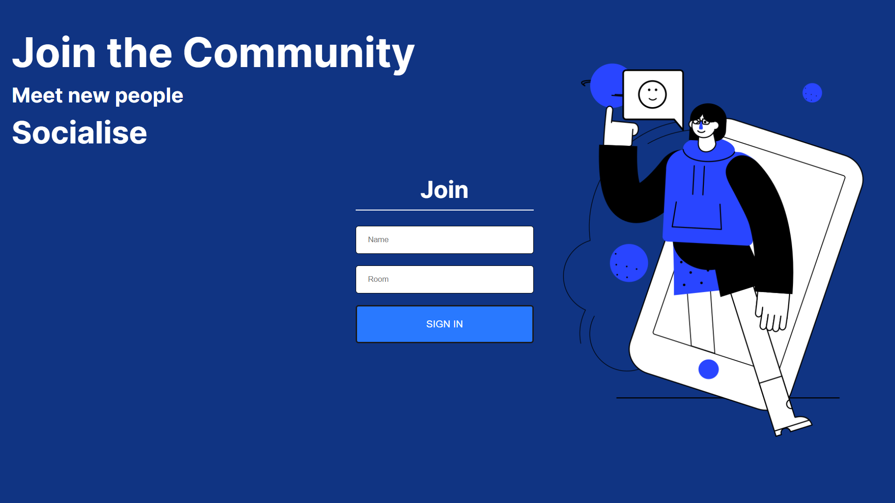
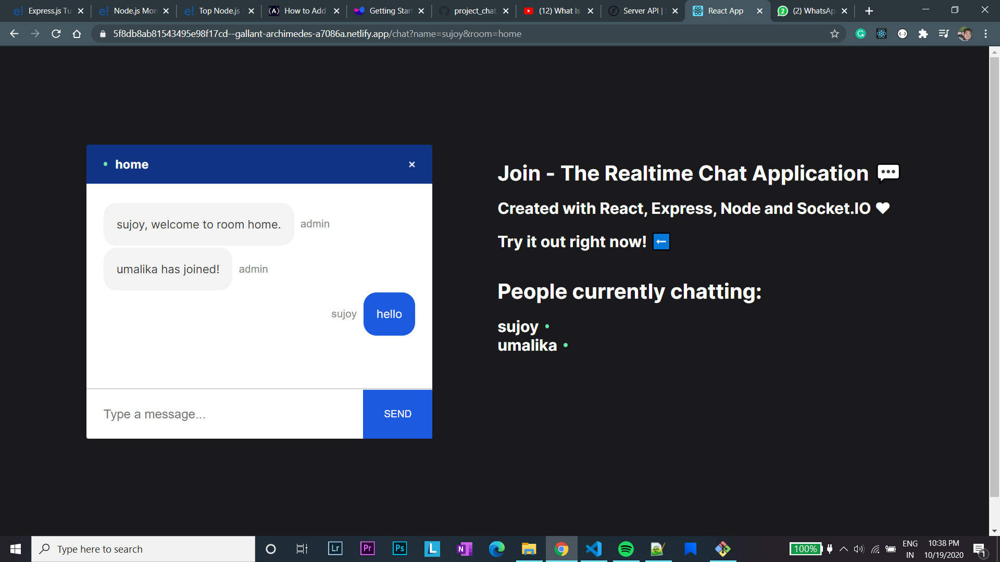
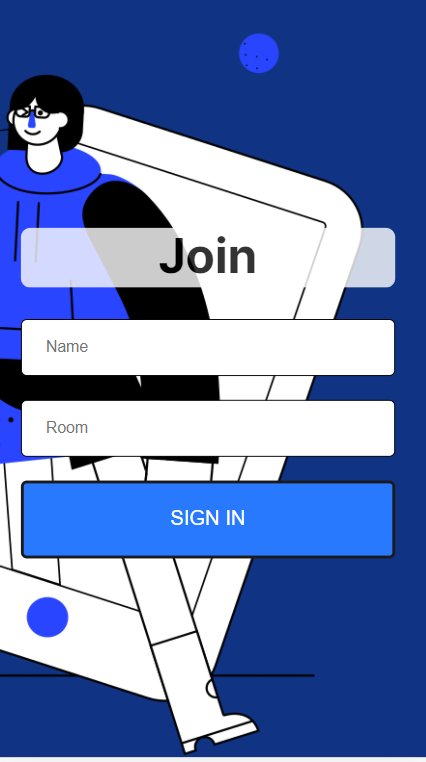
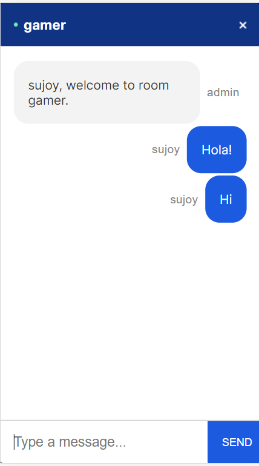

# RealTimeChatApp

My objective was to develop a chat application that enables users to create rooms, engage in real-time communication, and send emojis. The application is built using web sockets, leveraging Socket.io for seamless, live interactions.

 

# The project structure is distributed into sections - 
* client 
* server
# The libraries included in this app are - 
* For the Server side it has the backend packages like -
  * Node.js 
  * Express.js(CORS middleware) 
  * Socket.io 
  * Nodemon
* For the Client side - 
  * React 
  * React-router 
  * React-emoji 
  * Query-string 
  * Socket.io Client 

# Setting up the server-side

Most of the server-side setup involves using the HTTP module, which is then encapsulated within Socket.io for real-time communication. Express simplifies the setup process and allows integration of various middleware, including CORS middleware, which has been utilized in this project. 

All user management tasks—such as adding and removing users and performing administrative functions—are handled on the server side. Additionally, the Nodemon module is used to automate server restarts, enhancing the development workflow.

# Setting up the client-side 
Firstly, the design is completely mine, asthetics is an important part that I always try to maintain in all of my projects.
The home page design was build using a tool called blush which allows to make vector illustrations based on humaaans vector graphics.
The responsive design of the home page, changes when opened in a mobile-device.
Secondly, for React file structure two main components were created Join.js(Homepage) and Chat.js. All the other components were created on top of these main components
React-router is used for routing and apart from that for smooth scrolling react-scroll-to-bottom and react-emojis for more user interaction just like any other Chat-app.
Query-strings were used to parse the location i.e. Name & Room. 

Both the client and the server is connected using socket.io, the socket.io-client at the client side and socket.io in the server side enables the user to send constant events. There is constant emmiting and listening of events between the client and the server.

# Deployment
The server is deployed using Heroku and the client is deployed using Netlify.

# Features
* It shows the current users who are in the same room, 
* Send notifications when any user joins or left,
* This chat app allows the entry of unique users for a single room For ex- if Joe is in room "Gamers" he cannot join within the same name.

# Future Scope
* This app is currently session based and does not at any circumstances stores or monitors the Chat going in any room. 
* Will be connected to a database either FIrebase or MongoDB to act as cache so that users can take a look at their previous chats.
* A column will be added to show all the online users.
* The ability to add images, videos and docs.
* To add a variety of emojis more easily